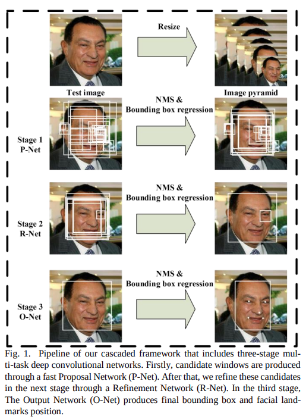
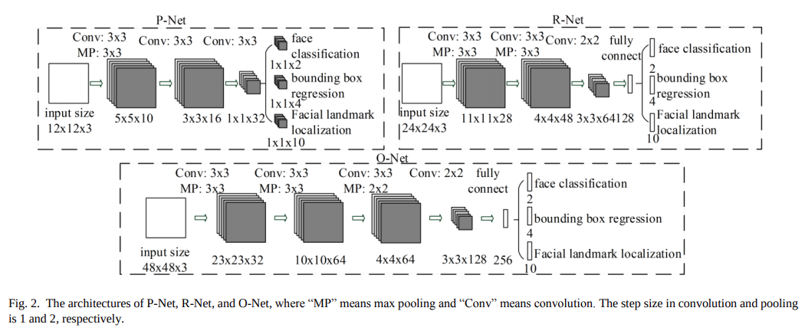
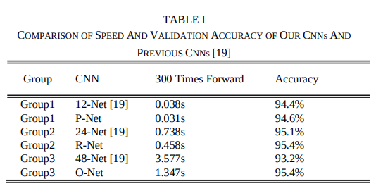

# MTCNN speed improvement
Motivation: In case that locations of camera and subject are fixed, 
the model could be simplified so it gets big speed gain with minor accuracy loss

MTCNN pipeline  
  
1. (Image rescale & P-Net) repeat this step by the number of scale factors
2. R-Net with step1 result as an input
3. O-Net with step2 result as an input

The architectures for each network
  

Inference time for each network  

  

* It shows that the O-Net takes the biggest part from total inference time
* O-Net has the same output shape as R-Net's  

From these facts, we can simply remove O-Net and expect speed improvement

## Test
1. Original performance  
   w/  face inside the box: 0.29 sec / frame  
   w/o face: 0.23 sec / 30 frames  

2. O-Net removal  
   w/  face inside the box: 0.26 sec / frame  
   w/o face: 0.23 sec / 30 frames  

3. Image Pyramid removal  
   w/  face inside the box: 0.10 sec / frame  
   w/o face: 0.03 sec / 30 frames  

4. __O-Net removal & Image Pyramid removal__  
   w/  face inside the box: __0.07 sec / frame__  
   w/o face: __0.03 sec / frame__  
   
The best one from above took only 1/4 from the original(0.29 --> 0.07).  
Although this performance is not as good as Haar Cascade(<0.01 sec), but comparable
to MobileNetSSD(which uses Tensorflow) and __enough to be used in our project__(Face-detection
with fixed camera and subject).
